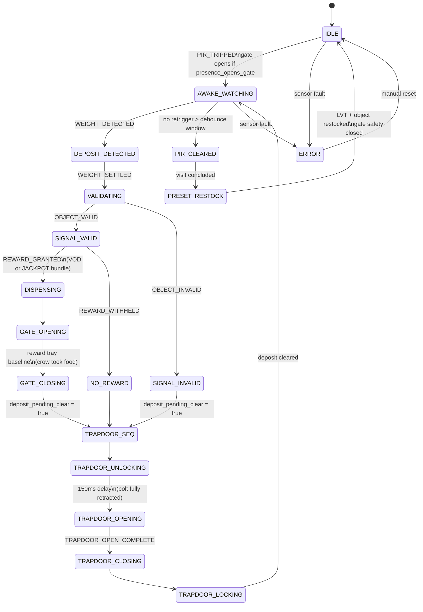

# CrowBox State Machine

## Notes

Stage 1 vs Stage 2 differences are handled within states, not as separate flows:
- Stage 1: gate opens on PIR, object dispenser fires at PRESET_RESTOCK
- Stage 2: gate only opens on DISPENSING, no object dispenser

Reward bundle at DISPENSING:
- VOD → HVT (hopper 2)
- JACKPOT → LVT + HVT + EHVT (hoppers 1+2+3)

TRAPDOOR_SEQ fires after any deposit (valid or invalid) once crow has departed.

presence_opens_gate is a config bool — true for stage 1 by default, configurable for stage 2.